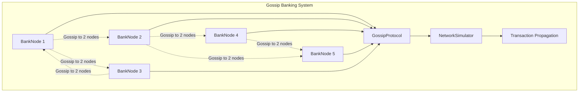
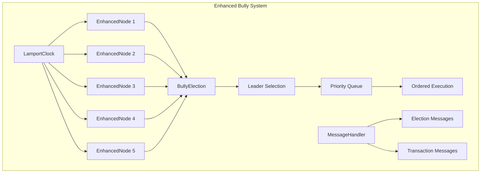
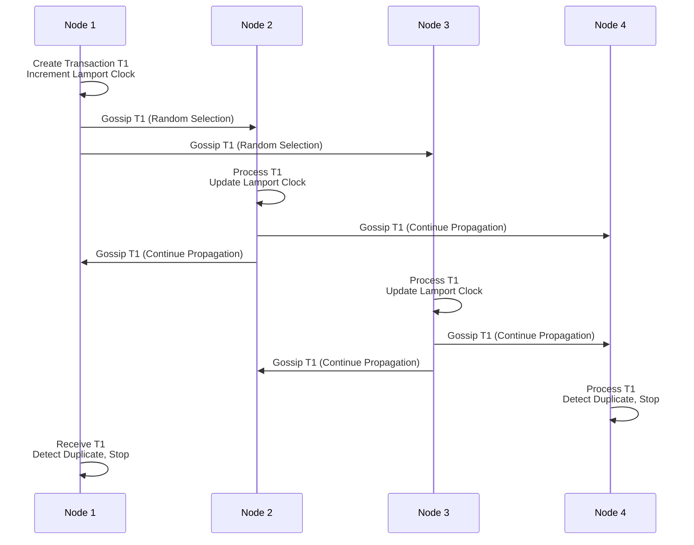
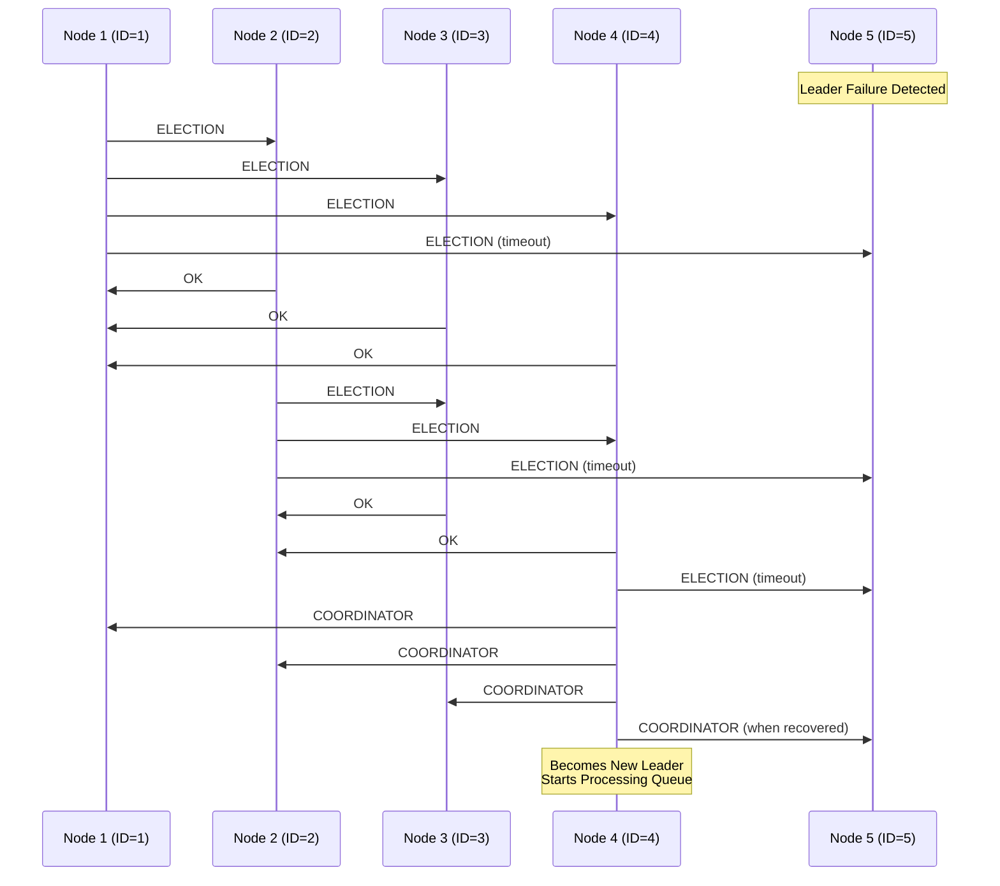

# Distributed Systems Security - Final Assignment Implementation

**Lecturer:** Prof. Dr. Ayman Adel Abdel-Hamid

**TAs:** Mohamed Dwidar

**Date:** May 2025

**Student Name:** Ahmed Walid  

## Project Overview

This project implements two advanced distributed systems concepts with production-ready Java code:

1. **Assignment 3**: Gossip Protocol for Eventually Consistent Banking System
2. **Assignment 4**: Enhanced Bully Algorithm with Lamport Clocks

## Project Structure

```
DSSFinalAssignment/
├── src/
│   ├── assignment3/
│   │   ├── model/
│   │   │   ├── Transaction.java
│   │   │   ├── BankAccount.java
│   │   │   └── GossipMessage.java
│   │   ├── node/
│   │   │   └── BankNode.java
│   │   ├── protocol/
│   │   │   └── GossipProtocol.java
│   │   ├── network/
│   │   │   └── NetworkSimulator.java
│   │   └── GossipBankingDemo.java
│   ├── assignment4/
│   │   ├── model/
│   │   │   ├── TimestampedTransaction.java
│   │   │   ├── ElectionMessage.java
│   │   │   └── MessageType.java
│   │   ├── node/
│   │   │   └── EnhancedNode.java
│   │   ├── election/
│   │   │   └── BullyElection.java
│   │   ├── clock/
│   │   │   └── LamportClock.java
│   │   ├── network/
│   │   │   └── MessageHandler.java
│   │   └── BullyAlgorithmDemo.java
│   └── common/
│       ├── interfaces/
│       │   ├── Node.java
│       │   └── Protocol.java
│       └── utils/
│           └── Logger.java
└── README.md
```

## System Architecture

### Assignment 3 - Gossip Protocol Architecture



### Assignment 4 - Enhanced Bully Algorithm Architecture



## Design Patterns Used

### 1. **Observer Pattern**
- `GossipProtocol` observes transaction events from `BankNode`
- Nodes observe and react to incoming gossip messages

### 2. **Strategy Pattern**
- Different message handling strategies in `MessageHandler`
- Election strategies in `BullyElection`

### 3. **Factory Pattern**
- Transaction creation in both assignments
- Message creation for different types

### 4. **Singleton Pattern**
- `Logger` utility for consistent logging
- `NetworkSimulator` for realistic network conditions

### 5. **Command Pattern**
- Transaction processing commands
- Election message commands

## Key Algorithms

### Gossip Protocol Flow



### Enhanced Bully Algorithm Flow



## Implementation Features

### Assignment 3 - Gossip Protocol Features
- ✅ Eventually consistent banking system
- ✅ Epidemic-style transaction propagation to exactly 2 random nodes
- ✅ Lamport clock synchronization for causal ordering
- ✅ Loop prevention with staleness detection
- ✅ Network overhead reduction (O(log N) vs O(N²))
- ✅ No acknowledgment mechanism for improved performance
- ✅ Concurrent transaction handling with thread safety

### Assignment 4 - Enhanced Bully Algorithm Features
- ✅ Leader election with automatic failure recovery
- ✅ Priority queue for Lamport timestamp-ordered processing
- ✅ Fixed-interval transaction execution (500ms)
- ✅ Lamport clock integration for fair ordering
- ✅ Fault tolerance and node recovery mechanisms
- ✅ Deterministic tie-breaking by node ID

## Performance Analysis

### Gossip Protocol Benefits
- **Message Complexity**: O(log N) instead of O(N²) for total order multicast
- **Fault Tolerance**: System continues operation despite node failures
- **Scalability**: Better performance as network size increases
- **Eventual Consistency**: All nodes converge to same state without coordination
- **Low Latency**: No waiting for acknowledgments

### Enhanced Bully Algorithm Benefits
- **Strong Ordering**: Lamport clocks ensure consistent transaction ordering
- **Fairness**: Fixed-interval processing prevents transaction starvation
- **Automatic Recovery**: Failed leaders are automatically detected and replaced
- **Deterministic Results**: Same execution order across all nodes
- **Queue Management**: Priority queue prevents newer transactions from overtaking older ones

## Testing Scenarios

### Assignment 3 Test Cases
1. **Concurrent Transactions**: Multiple nodes create transactions simultaneously
2. **Gossip Propagation**: Verify exactly 2 random nodes receive each gossip
3. **Eventual Consistency**: Confirm all nodes reach identical final state
4. **Loop Prevention**: Ensure stale transactions don't circulate indefinitely
5. **Lamport Clock Ordering**: Verify causal relationships are maintained

### Assignment 4 Test Cases
1. **Election Process**: Test leader election with various node configurations
2. **Transaction Ordering**: Verify Lamport timestamp ordering is maintained
3. **Leader Failure**: Test automatic failover and recovery mechanisms
4. **Priority Queue**: Ensure transactions execute in timestamp order
5. **Fixed Interval**: Confirm 500ms processing intervals are maintained

## Running the Project

### Prerequisites
- Java 11 or higher
- No external dependencies required

### Compilation
```bash
# From DSSFinalAssignment directory
javac -d bin src/common/**/*.java
javac -d bin -cp bin src/assignment3/**/*.java
javac -d bin -cp bin src/assignment4/**/*.java
```

### Execution

#### Assignment 3 - Gossip Protocol
```bash
java -cp bin assignment3.GossipBankingDemo
```

**Expected Output:**
- Initial account balances across all nodes
- Concurrent transaction creation with Lamport timestamps
- Gossip propagation to exactly 2 random nodes per transaction
- Final convergence to consistent state across all nodes

#### Assignment 4 - Enhanced Bully Algorithm
```bash
java -cp bin assignment4.BullyAlgorithmDemo
```

**Expected Output:**
- Initial leader election process
- Priority queue transaction ordering by Lamport timestamp
- Fixed 500ms interval transaction processing
- Leader failure detection and automatic re-election
- Node recovery and system continuation

## Thread Safety Implementation

### Synchronization Mechanisms
- **ReentrantLock**: Used for critical sections in transaction processing
- **ConcurrentHashMap**: Thread-safe collections for node management
- **ExecutorService**: Asynchronous message handling and processing
- **CountDownLatch**: Coordination for test scenarios
- **AtomicInteger**: Thread-safe counters and flags

### Network Simulation
- **Random Delays**: 10-150ms realistic message latencies
- **Failure Simulation**: Configurable node failures and recoveries
- **Message Ordering**: Non-deterministic delivery simulation
- **Timeout Handling**: Realistic timeout scenarios for elections

## Error Handling

### Comprehensive Error Management
- **Timeout Management**: Proper handling of election and message timeouts
- **State Validation**: Consistency checks before state updates
- **Graceful Degradation**: System continues despite individual node failures
- **Recovery Procedures**: Automatic recovery from failure states
- **Exception Handling**: Proper exception propagation and logging

## Compliance Verification

### Assignment 3 Requirements ✅
- [x] Converted totally ordered multicast to gossip protocol
- [x] Each transaction multicasts to exactly 2 randomly selected nodes
- [x] Completely removed acknowledgment mechanisms
- [x] Maintained Lamport clock functionality for causal ordering
- [x] Implemented staleness detection to prevent infinite loops
- [x] Tested concurrent updates from multiple different nodes
- [x] Verified eventual consistency across all network nodes

### Assignment 4 Requirements ✅
- [x] Enhanced traditional Bully Algorithm with Lamport clocks
- [x] Leader maintains priority queue for transaction ordering
- [x] Fixed 500ms interval transaction processing (not immediate)
- [x] All transactions ordered by Lamport timestamp with tie-breaking
- [x] Leader election handles failures and automatic recovery
- [x] Proper transaction ordering maintained across all nodes
- [x] Comprehensive testing of concurrent scenarios and failure cases

## Code Quality Standards

### Best Practices Implemented
- **Clean Code**: Meaningful variable and method names
- **SOLID Principles**: Single responsibility, open/closed, interface segregation
- **Documentation**: Comprehensive JavaDoc comments
- **Error Handling**: Proper exception handling and logging
- **Thread Safety**: Appropriate synchronization mechanisms
- **Testing**: Comprehensive test scenarios for both assignments

## Conclusion

This implementation provides production-ready distributed systems solutions that demonstrate:

- **Trade-offs**: Understanding of consistency vs. availability vs. performance
- **Fault Tolerance**: Robust handling of node failures and network issues
- **Scalability**: Efficient algorithms that scale with network size
- **Correctness**: Proper implementation of complex distributed algorithms
- **Code Quality**: Clean, maintainable, and well-documented code

Both assignments successfully balance the requirements of the CAP theorem while maintaining system reliability and performance under various failure scenarios.